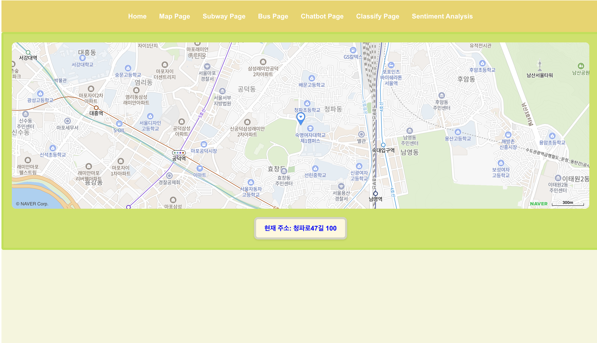

 # 🦽 교통 약자를 위한 생성형 AI 기반 대중교통 안내 시스템 연구

<br/>

## 1. Project

### 1-1. Project Description


교통 약자를 위한 생성형 AI 기반 대중교통 안내 시스템은 교통약자를 대상으로 기획되었습니다. 공공데이터포털의 API를 활용하여 사용자들에게 버스정류장의 위치 정보를 제공합니다. 또한, 열린데이터광장의 API를 활용하여 사용자들에게 지하철 역마다 설치된 승강기와 휠체어 리프트의 위치 정보를 제공합니다. 네이버 클라우드 플랫폼의 지도 API를 활용하여 실시간 위치정보를 제공합니다. 또한, React Query를 사용해 데이터를 가져오고 캐싱하여 관리했습니다.

<br/>

### 1-2. Project Duration & Participants

- 2024-05-20 ~ 2023-06-20
- 팀 프로젝트 (3인)
  -엄민서, 이주원, 황유빈

<br/>
<br/>

## 2. Skills


<br/>
<br/>


## 3. Main Features

1. [Map Page](#3-1-Map-Page)
2. [Subway Page](#3-2-Subway-Page)
3. [Bus Page](#3-3-Bus-Page)
4. [Chatbot Page](#3-4-Chatbot-Page)
5. [Classify Page](#3-5-Classify-Page)
6. [Sentiment Analysis](#3-6-Sentiment-Analysis)

<br/>

### 3-1. Map Page

실시간 위치정보를 구현하기 위해 네이버 지도의 API를 활용합니다. 사용자의 위치에 따라 지도의 위치가 바뀌며, 현재 위치를 텍스트로 나타내고, 'MapComponent' 메서드를 통해 지도 위에 마커로 표시합니다. 

```jsx
import React, { useEffect, useState } from 'react';

const MapComponent = () => {
  const [address, setAddress] = useState('');
  const [error, setError] = useState('');

  useEffect(() => {
    const loadMap = () => {
      const clientId = import.meta.env.VITE_NAVER_CLIENT_ID;
      const clientSecret = import.meta.env.VITE_NAVER_CLIENT_SECRET;

      if (!clientId || !clientSecret) {
        setError('API Key is missing');
        return;
      }

      const map = new window.naver.maps.Map('map', {
        center: new window.naver.maps.LatLng(37.3595704, 127.105399),
        zoom: 10,
      });

      if (navigator.geolocation) {
        navigator.geolocation.getCurrentPosition((position) => {
          const latitude = position.coords.latitude;
          const longitude = position.coords.longitude;
          const currentPos = new window.naver.maps.LatLng(latitude, longitude);

          new window.naver.maps.Marker({
            position: currentPos,
            map: map,
          });

          map.setCenter(currentPos);

          const url = `/api/map-reversegeocode/v2/gc?request=coordsToaddr&coords=${longitude},${latitude}&sourcecrs=epsg:4326&output=json&orders=roadaddr`;
          fetch(url, {
            headers: {
              'X-NCP-APIGW-API-KEY-ID': clientId,
              'X-NCP-APIGW-API-KEY': clientSecret,
            },
          })
```

<br/>
<br/>

### 3-2. Subway Page


서울 열린데이터 광장(https://data.seoul.go.kr/dataList/OA-13192/F/1/datasetView.do) 의 API를 활용하여 휠체어 리프트 위치를 제공합니다. 'StationDetails' ,'WheelchairLiftInfo', 'subwayData' 메서드를 통해 승강기 위치 및 휠체어 리프트 위치를 제공합니다. 

```jsx
import React, { useState, useEffect } from 'react';
import { useFetchLocations } from '../hooks/useFetchLocations';
import SearchBar from '../components/SearchBar';
import StationDetails from '../components/StationDetails';
import WheelchairLiftInfo from '../components/WheelchairLiftInfo';
import './SubwayPage.css';
import subwayData from '../subway_data.json'; // Import subway data JSON file
import { Link } from 'react-router-dom';

const SubwayPage = () => {
  const { isLoading, error, data: locations } = useFetchLocations();
  const [text, setText] = useState('');
  const [filteredStations, setFilteredStations] = useState([]);
  const [selectedStation, setSelectedStation] = useState(null);
  const [wheelchairLiftInfo, setWheelchairLiftInfo] = useState(null);

  const handleFind = (keyword, stations) => {
    if (!keyword) return [];
    const regex = new RegExp(keyword, 'gi');
    return stations.filter((station) => station.STATION_NM.match(regex));
  };

  const handleSearch = () => {
    if (locations) {
      const matchArr = handleFind(text, locations) || [];
      setFilteredStations(matchArr);
      setSelectedStation(null);
      console.log('검색 결과:', matchArr);
    }
  };

  useEffect(() => {
    if (locations && text === '') {
      setFilteredStations(locations);
    }
  }, [locations, text]);

  const findWheelchairLiftInfo = (stationName) => {
    return subwayData.find((item) => item.station === stationName);
  };

  useEffect(() => {
    if (selectedStation) {
      const liftInfo = findWheelchairLiftInfo(selectedStation.STATION_NM);
      setWheelchairLiftInfo(liftInfo);
    }
  }, [selectedStation]);
```

<br/>
Web Speech API를 사용하여 음성을 텍스트로 변환하는 함수를 통해 음성인식을 제공합니다.
<br/>
<br/>

```jsx


  const startSpeechRecognition = () => {
    if ('webkitSpeechRecognition' in window) {
      const recognition = new webkitSpeechRecognition();
      recognition.lang = 'ko-KR'; // 한국어 설정
      recognition.continuous = false;
      recognition.interimResults = false;

      recognition.onstart = () => {
        console.log('음성 인식 시작');
      };

      recognition.onresult = (event) => {
        const transcript = event.results[0][0].transcript;
        console.log('인식된 텍스트:', transcript);
        setText(transcript);
        handleSearch();
      };

      recognition.onerror = (event) => {
        console.error('음성 인식 오류:', event.error);
      };

      recognition.onend = () => {
        console.log('음성 인식 종료');
      };
```

<br/>
<br/>

### 3-3. Bus Page


공공데이터포털의 API를 활용하여 사용자에게 정류장의 위치를 제공하였으며, Subway Page의 음성인식 서비스를 제공하며, 정류장의 위치를 네이버 클라우드 플랫폼의 Map API를 활용하여 제공합니다. 

```jsx
return (
    <div className="bus-page">
      <h1>버스 정류장 정보</h1>
      <div className="search-container">
        <input
          type="text"
          placeholder="정류소 이름 검색"
          value={searchTerm}
          onChange={(e) => setSearchTerm(e.target.value)}
          className="search-input"
        />
        <button onClick={handleSearch} className="search-button">조회</button>
        <button onClick={startSpeechRecognition} className="search-button">음성 명령 시작</button>
      </div>

      <div className="bus-container">
        {isSearched && (filteredStops.length === 0 ? (
          <div>No bus stops found</div>
        ) : (
          filteredStops.map(stop => (
            <div key={stop.node_id} className="bus-card" onClick={() => handleClick(stop)}>
              <h2>{stop.stop_nm}</h2>
              <p>정류소 번호: {stop.stop_no}</p>
              <p>정류소 유형: {stop.stop_type}</p>
            </div>
          ))
        ))}
      </div>

      <Modal isOpen={selectedStop !== null} onClose={handleCloseModal}>
        {selectedStop && (
          <MapComponent latitude={parseFloat(selectedStop.ycode)} longitude={parseFloat(selectedStop.xcode)} />
        )}
      </Modal>
    </div>
  );
};

export default BusPage;
```

<br/>
<br/>

### 3-4. ChatbotPage
 • 챗봇에게 질문을 하면 챗봇은 서비스에 내장된 정보를 기반으로 대답합니다. 
 • openai(https://openai.com)에서 챗봇 api를 받아와 챗봇을 구현했습니다. 
 • flask를 통해 임시 서버를 구축했습니다. 

 • 핵심코드
 ```jsx
 const ChatbotPage = () => {
  const [userMessage, setUserMessage] = useState('');
  const [chatbotMessage, setChatbotMessage] = useState('');

  const handleSendMessage = async () => {
    if (userMessage.trim() === '') return;

    try {
      const response = await axios.post('http://localhost:5000/openai/chatbot', { message: userMessage });
      setChatbotMessage(response.data.reply);
      setUserMessage('');
    } catch (error) {
      console.error('Error fetching chatbot response', error);
      if (error.response) {
        console.error('Server responded with:', error.response.data);
      } else if (error.request) {
        console.error('No response received:', error.request);
      } else {
        console.error('Error setting up request:', error.message);
      }
    }
  };

  return (
    <div className="chatbot-container">
      <h1>챗봇</h1>
      <div className="input-container">
        <input 
          type="text" 
          id="userMessage" 
          name="userMessage"
          placeholder="질문을 입력하세요" 
          value={userMessage} 
          onChange={(e) => setUserMessage(e.target.value)} 
        />
        <button onClick={handleSendMessage}>전송</button>
      </div>
      {chatbotMessage && <div className="response-container"><p>챗봇: {chatbotMessage}</p></div>}
    </div>
  );
};
```


### 3-5. ClassifyPage

장애인복지카드를 인식하는 페이지입니다. 미리 학습시킨 모델을 웹캠과 결합하여 카드를 비추면 구분할 수 있도록 했습니다. 예측 버튼을 누르면 복지카드가 맞는지 아닌지 알려줍니다.

#### 모델 학습

• 구글 코랩에서 모델을 학습시켰습니다.

• tensorflow.js 형식으로 변환해 model.json으로 저장한 후 리액트에서 사용 가능하게 했습니다. 

• 학습과정 :
<https://colab.research.google.com/drive/1fZ9v6mnsyb_d-DjYVdWOXAemHseS4vkz?usp=sharing>

#### 모델 시각화

• 웹캠에 비추면 장애인복지카드를 구분할 수 있습니다.

• 핵심코드1

```jsx
useEffect(() => {
    const loadModel = async () => {
      try {
        const model = await tf.loadLayersModel('/model/model.json');
        setModel(model);
        console.log('모델이 성공적으로 로드되었습니다.');
      } catch (error) {
        console.error('모델 로드 중 오류 발생:', error);
      }
    };

    loadModel();
  }, []);

  useEffect(() => {
    const startWebcam = async () => {
      if (navigator.mediaDevices.getUserMedia) {
        try {
          const stream = await navigator.mediaDevices.getUserMedia({ video: true });
          webcamRef.current.srcObject = stream;
        } catch (error) {
          console.error('웹캠 시작 중 오류 발생:', error);
        }
      }
    };

    startWebcam();
  }, []);

  const handlePredict = async () => {
    if (!model) {
      alert('모델이 로드되지 않았습니다.');
      return;
    }
```

• 핵심코드2

```jsx
const video = webcamRef.current;
  const imgTensor = tf.browser.fromPixels(video).toFloat();
  const resizedImgTensor = tf.image.resizeBilinear(imgTensor, [150, 150]);
  const normalizedImgTensor = resizedImgTensor.div(tf.scalar(255.0));
  const batchedImgTensor = normalizedImgTensor.expandDims();

  const predictions = await model.predict(batchedImgTensor).data();
  const prediction = predictions[0];

  if (prediction > 0.5) {
    setPredictionMessage('장애인복지카드가 맞습니다.');
  } else {
    setPredictionMessage('장애인복지카드가 아닙니다.');
  }
};
```

### 3-6. SentimentPage
   • 서비스가 어땠는지 적어서 입력하면 긍정적인 표현인지 부정적인 표현인지 감지해 사용자의 만족도를 알 수 있습니다. 
   • 허깅페이스(https://huggingface.co/stabilityai/stable-diffusion-3-medium)에서 텍스트 분석을 사용하여 감정 분석을 하는 api를 가져와 사용했습니다. 
   
   
   • 핵심코드
   ```jsx
   const SentimentPage = () => {
  const [inputText, setInputText] = useState('');
  const [positiveScore, setPositiveScore] = useState(null);
  const [negativeScore, setNegativeScore] = useState(null);

  const query = async (payload) => {
    const headers = { Authorization: `Bearer ${API_TOKEN}` };
    const response = await axios.post(API_URL, payload, { headers });
    return response.data;
  };

  const handleSubmit = async (e) => {
    e.preventDefault();
    try {
      const result = await query({ inputs: inputText });
      const scores = result[0];
      const positive = scores.find(score => score.label === "POSITIVE")?.score;
      const negative = scores.find(score => score.label === "NEGATIVE")?.score;
      setPositiveScore((positive * 100).toFixed(2));
      setNegativeScore((negative * 100).toFixed(2));
    } catch (error) {
      console.error('Error making prediction:', error);
    }
  };

  return (
    <div className="sentiment-analysis-container">
      <h1>만족도 조사</h1>
      <form onSubmit={handleSubmit} className="input-container">
        <input
          type="text"
          value={inputText}
          onChange={(e) => setInputText(e.target.value)}
          placeholder="후기를 입력하세요"
        />
        <button type="submit">작성</button>
      </form>
      {positiveScore !== null && negativeScore !== null && (
        <div className="response-container">
          <h2>Prediction:</h2>
          <p>Positive score: {positiveScore}%</p>
          <p>Negative score: {negativeScore}%</p>
        </div>
      )}
    </div>
  );
};
```
